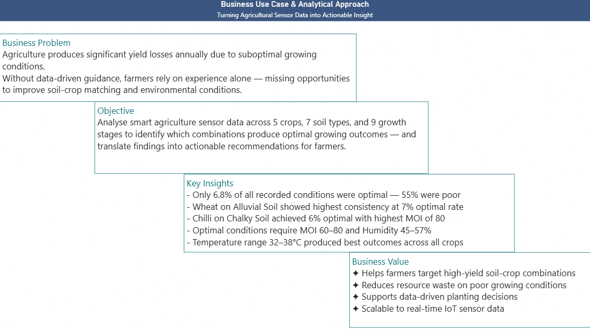
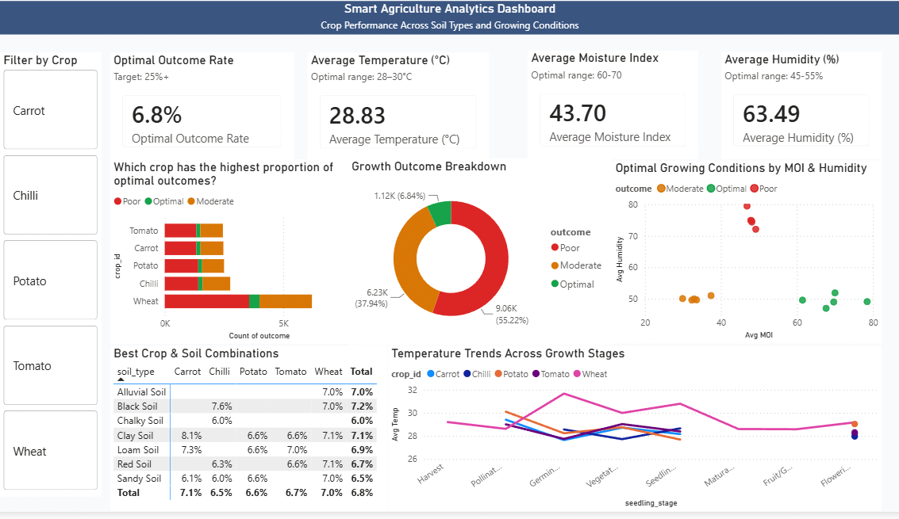
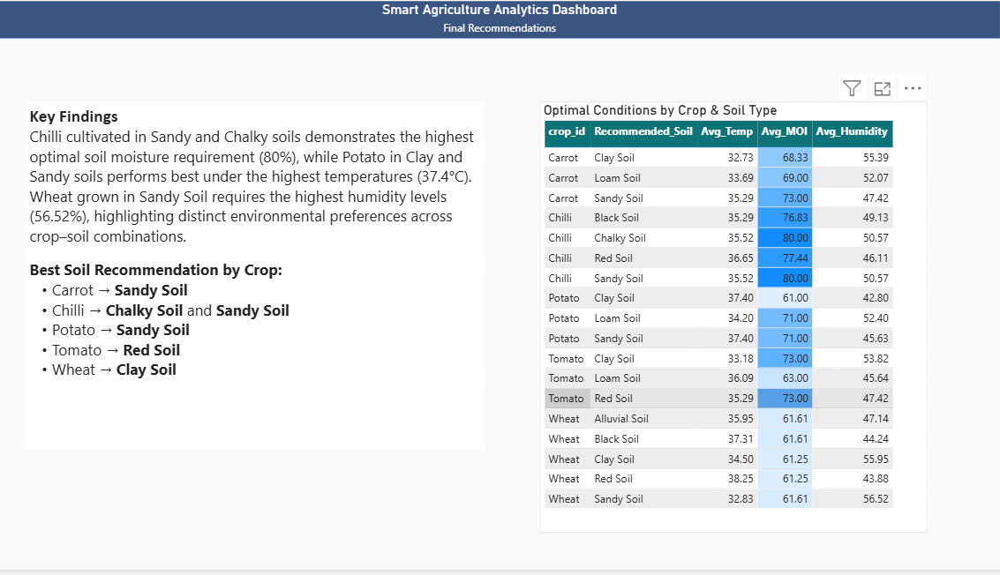

# smart-agriculture-powerbi-dashboard
Power BI dashboard analysing optimal growing conditions across 5 crops, 7 soil types and 9 growth stages

# 🌱 Smart Agriculture Analytics Dashboard
**Tool:** Power BI | **Data:** Kaggle Smart Agriculture Dataset

## Business Problem
Only 6.8% of agricultural growing conditions were optimal. 
This dashboard identifies which crop-soil-environment combinations 
produce the best outcomes.

## Key Findings
- 55% of conditions were poor, only 6.8% optimal
- Chilli on Sandy Soil achieved highest MOI of 78
- Tomato performs best on Red Soil
- Optimal conditions: MOI 60-80, Humidity 45-57%

## Dashboard Pages
### Page 1 — Crop Performance Overview

### Page 2 — Growing Conditions Analysis  

### Page 3 — Final Recommendations

## Tools Used
- Power BI Desktop
- DAX measures
- Power Query transformations
- MySQL data preparation
- Star-schema data modelling

## 💡 How to Use
1. Download the `BI_market_mindz.pbix` file from this repository.
2. Install [Power BI Desktop](https://powerbi.microsoft.com).
3. Open the file to explore the interactive filters and drill-down features.

---
## 👤 Author
**Ramu Valliappan**  
https://www.linkedin.com/in/ramu-valliappan | https://github.com/RamuLincoln/smart-agriculture-powerbi-dashboard/blob/main/crop-performance.pbix

